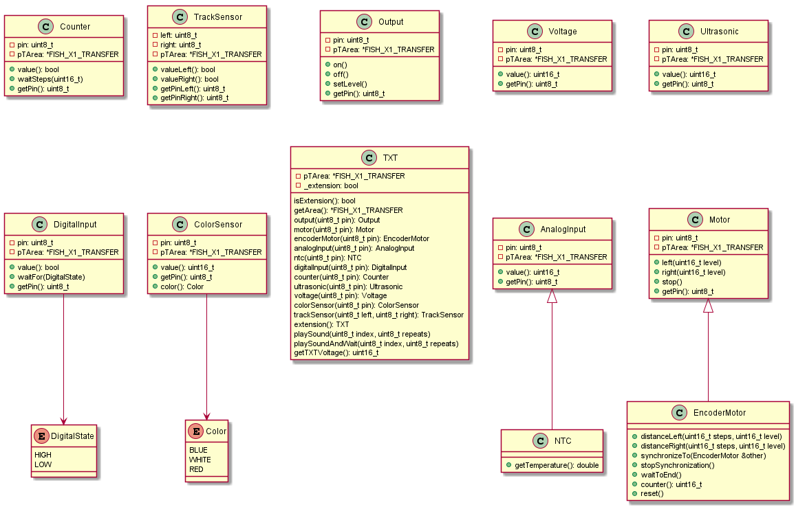
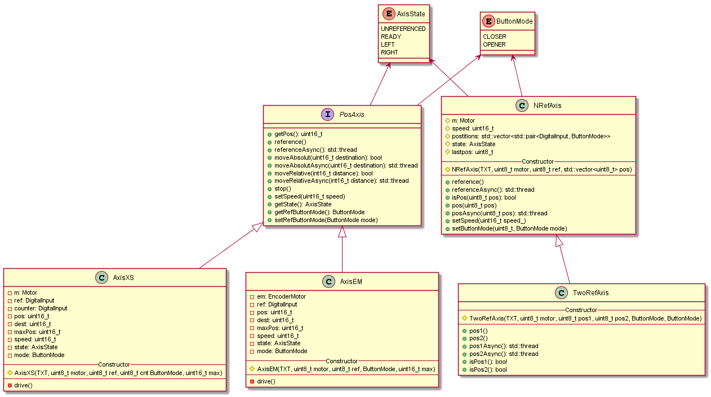

# Fischertechnik Fabrik Anleitung

## API

## Raspberry PI

Username: pi

Password: fischertechnik

docker-compose Konfiguration: /home/fischertechnik

MQTT Broker:
* Port: 1883 / 9001
* starten: docker-compose up -d broker
* stoppen: docker-compose stop broker

Node-RED:
* Port: 1880
* starten: docker-compose up -d node-red
* stoppen: docker-compose stop node-red

Die Commands können nur in dem entsprechenden Konfigurationsordner ausgeführt werden.

## MQTT

Topic | Wert | Beschreibung
--- | --- | ---
/i/wh/stock | json array | Hochregallager Belegung
/i/sl/state | text  | Sortierstrecke Status
/i/vr/state | text | Vakuum Greifer Status
/i/wh/state | text | Hochregallager Status
/i/ps/state | text | Bearbeitungsstation Status
/i/sl/lastcolor | text | zuletzt erkannte Farbe (Farbsensor)
/i/sl/rawlastcolor | double | zuletzt gemessener Wert (Farbsensor)
|
/d/ps | json objekt | TXT state der Bearbeitungsstation
/d/sl | json objekt | TXT state der Sortierstrecke
/d/vr | json objekt | TXT state Vakuumgreifer/Hochregallager
/d/msg | text | Debug Message
|
/m/vr/m2/t | double | Temperatur von M2 am Vakuumgreifer
/m/vr/o7/v | int | Spannung von O7 am Vakuumgreifer
/m/sl/m1/t | double | Temperatur von M1 an der Sortierstrecke
/m/sl/m1/v | int | Spannung von M1 an der Sortierstrecke

## Versionen

* [arm cross-compiler](https://releases.linaro.org/components/toolchain/binaries]): v. 7.2.1-2017.11-i686-mingw32_arm-linux-gnueabihf
* [TXT Helper Classes](https://github.com/fischertechnik/txt_demo_c_download)
* [Mosquitto MQTT](https://hub.docker.com/_/eclipse-mosquitto): v. 1.6
* [Node-RED](https://hub.docker.com/r/nodered/node-red): v. 1.0
* [IOBroker](https://hub.docker.com/r/buanet/iobroker): v. 4.2
* [Thingsboard](https://thingsboard.io/docs/user-guide/install/rpi/): v. 3.0.1